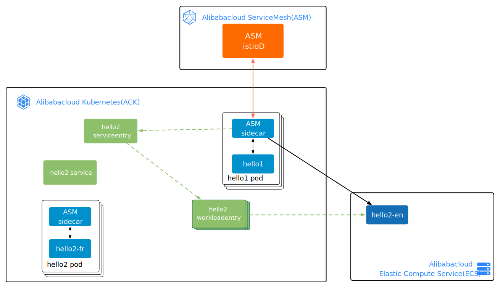
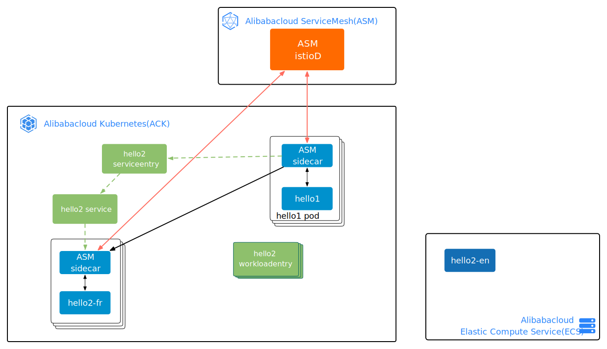

## Http WorkloadEntry


### setup mesh
```sh
sh sh/setup-pod-vm.sh
```

### setup vm
```sh
sh sh/ssh1.sh

docker run \
--rm \
--network host \
--name http_v1 \
registry.cn-beijing.aliyuncs.com/asm_repo/http_springboot_v1:1.0.0
```

### pod|vm test
```sh
sh sh/pod-vm-test.sh
```
```sh
>>> test hello1 -> hello2
Hello eric(172.18.0.216)<-Hello eric(192.168.0.170)
>>> test hello2 directly
Hello eric(192.168.0.170)
>>> test hello1 -> hello2
Hello eric(172.18.0.216)<-Bonjour eric(172.18.1.97)
>>> test hello2 directly
Bonjour eric(172.18.1.97)
...
```

### migrate test
> Bridging Kubernetes and VMs

| vm workload                                           | pod    workload                                       |
| ----------------------------------------------------- | ----------------------------------------------------- |
|  |  |

```sh
sh sh/migrate-test.sh
```

### reference
- https://istio.io/latest/blog/2020/workload-entry/
- https://istio.io/latest/docs/reference/config/networking/service-entry/